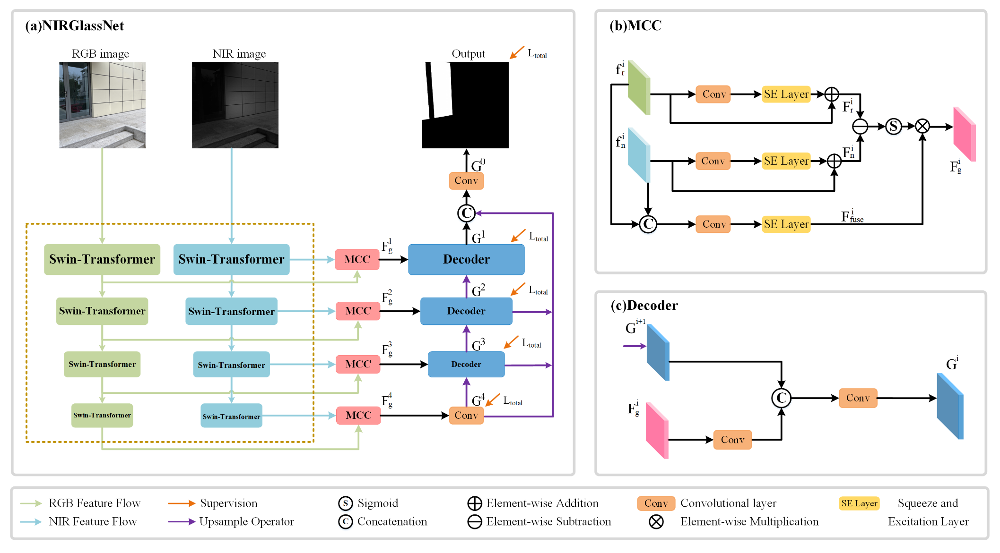
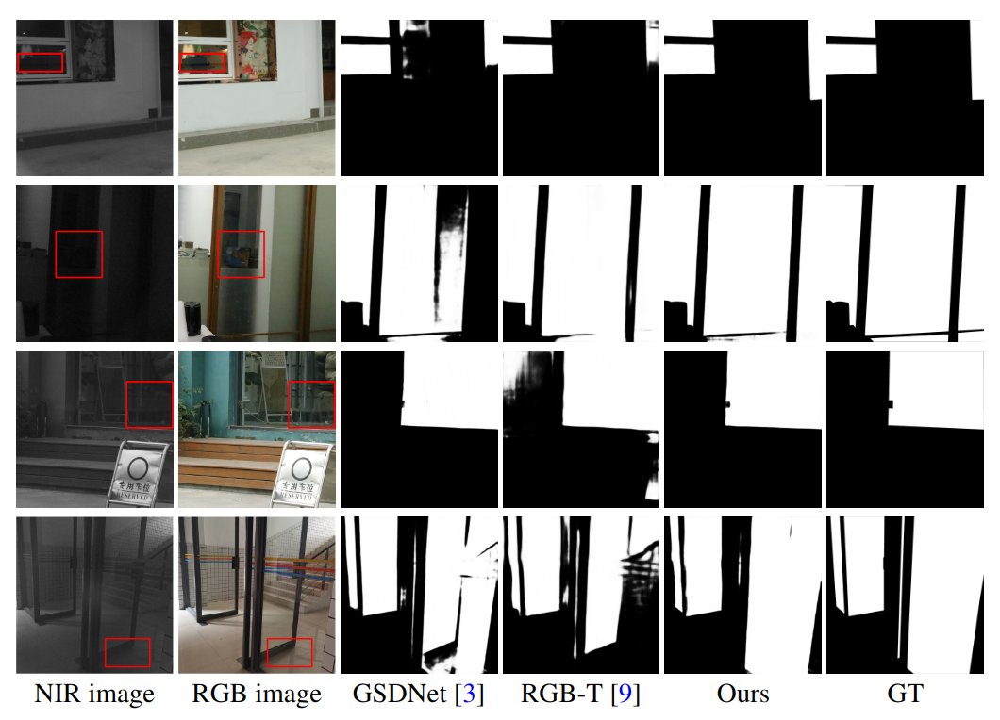

# NRGlassNet: Glass Surface Detection From Visible and Near-infrared Image Pairs
**Tao Yan, Shufan Xu, Hao Huang, Helong Li, Lu Tan, Xiaojun Chang and Rynson W. H. Lau, "NRGlassNet: Glass Surface Detection From Visible and Near-infrared Image Pairs," Knowledge-Based Systems, Apr. 2024, doi: 10.1016/j.knosys.2024.111722**  

The architecture of our proposed NRGlassNet.

This is the result of NRGlassNet:

Our RNGD dataset can be download from the following
link:https://pan.baidu.com/s/1oLCwZVvToqkBwnM_p2QA6Q 
password:2da8

**Contact**  

If you have any questions, please contact yan.tao@outlook.com
